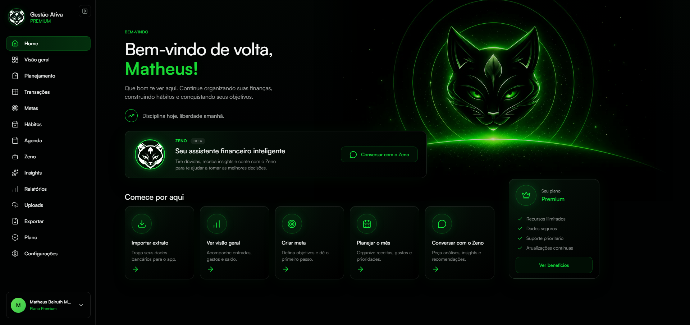
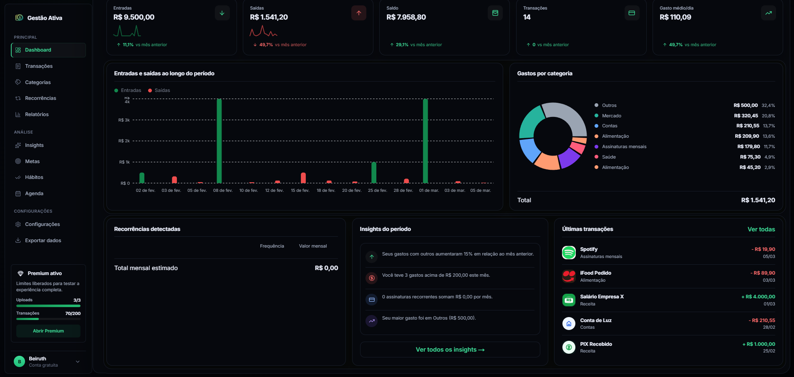
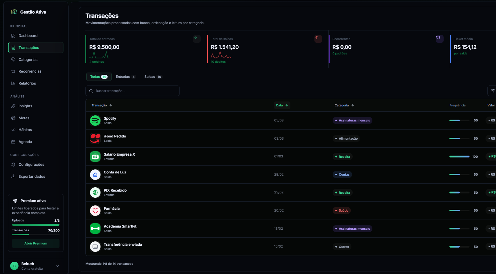
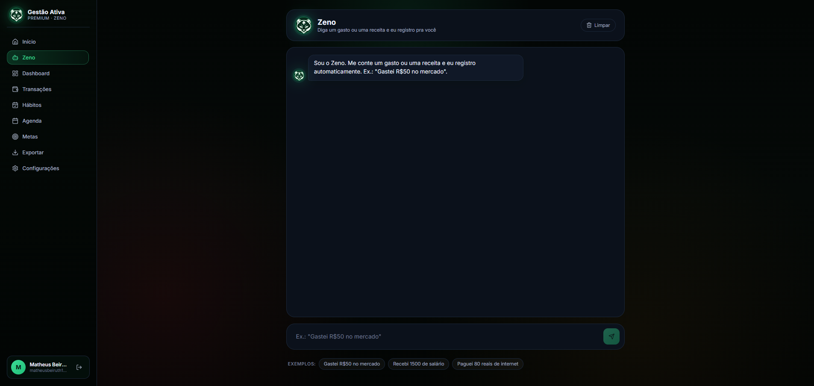

<div align="center">

# Gestão Ativa

**Análise financeira pessoal com inteligência — sem planilhas, sem complicação.**

[](https://nextjs.org/)
[](https://fastapi.tiangolo.com/)
[](https://www.typescriptlang.org/)
[](https://python.org/)

[**Ver Demo →**](#) · [Reportar Bug](https://github.com/BeiruthDEV/gestao-ativa-demo/issues) · [Solicitar Feature](https://github.com/BeiruthDEV/gestao-ativa-demo/issues)

</div>

---

## Visão Geral

Gestão Ativa transforma extratos bancários em insights financeiros acionáveis. Suba um PDF ou CSV do seu banco, e em segundos você tem categorização automática, logos das marcas, detecção de recorrências e um dashboard interativo — sem criar conta, sem conectar ao banco, sem expor credenciais.

O plano premium adiciona **Zeno**, um assistente de IA em linguagem natural, rastreamento de hábitos financeiros, metas com progresso visual e calendário financeiro.

---

## Demonstração

### Vídeo

[▶ Clique para assistir à demonstração](assets/demonstrando-software.mp4)

### Screenshots

| Home | Upload |
|:-:|:-:|
|  |  |

| Dashboard Free | Transações |
|:-:|:-:|
|  |  |

### Zeno — Assistente de IA



---

## Funcionalidades

### Plano Free
- **Upload de extratos** — suporte a PDF (pdfplumber) e CSV de qualquer banco
- **Categorização automática** — matching fuzzy em ~30 categorias pré-definidas
- **Brand logos** — resolução automática de logotipos via Clearbit API
- **Detecção de recorrência** — identifica assinaturas e despesas fixas
- **Dashboard interativo** — totais de receita/despesa, gráficos por categoria, linha temporal
- **Limite free** — 3 uploads e 200 transações/mês

### Plano Premium
- **Zeno AI** — log de transações em linguagem natural ("gastei R$50 no mercado")
- **Hábitos financeiros** — checklist diário + heatmap mensal de consistência
- **Metas de orçamento** — progresso visual por categoria com deadline
- **Agenda financeira** — calendário de contas, vencimentos e lembretes
- **Export avançado** — CSV filtrado por período, categoria, tipo
- **Insights premium** — tendências, análise de comportamento, alertas
- **Sem limites** — uploads e transações ilimitados

---

## Arquitetura

```
┌─────────────────────────────────────────────────────────────┐
│                        Browser                              │
│                                                             │
│  ┌──────────────────────────────────────────────────────┐   │
│  │              Next.js App Router (React 19)           │   │
│  │                                                      │   │
│  │  /                   → Dashboard free + Upload       │   │
│  │  /premium/dashboard  → Analytics avançado           │   │
│  │  /premium/zeno       → Chat AI (Zeno)               │   │
│  │  /premium/habits     → Hábitos + heatmap            │   │
│  │  /premium/goals      → Metas + progresso            │   │
│  │  /premium/agenda     → Calendário financeiro        │   │
│  │                                                      │   │
│  │  auth-context.tsx  ── premium flag                  │   │
│  │  localStorage      ── persistência client-side      │   │
│  └──────────────────────────────────────────────────────┘   │
│                         │ /api/v1/*                         │
└─────────────────────────┼───────────────────────────────────┘
                          │ proxy (next.config.ts rewrite)
                          ▼
┌─────────────────────────────────────────┐
│           FastAPI (Python)              │
│                                         │
│  POST /api/v1/upload                    │
│    └─ pdfplumber / pandas parse         │
│    └─ fuzzy category matching           │
│    └─ recurrence detection              │
│    └─ brand_resolver → Clearbit API     │
│    └─ returns JSON transactions + logos │
│                                         │
│  GET /api/v1/brand-icon?description=    │
│    └─ detect_brand() → logo URL         │
│                                         │
│  /backend/uploads/  (temp, auto-clean)  │
└─────────────────────────────────────────┘
                          │
                          ▼
               ┌──────────────────┐
               │   Clearbit API   │
               │  (brand logos)   │
               └──────────────────┘
```

**Princípios de design:**
- Zero banco de dados externo — toda persistência em `localStorage`
- Backend stateless — arquivos temporários descartados após parse
- Proxy transparente — frontend não conhece a porta do backend
- Middleware de rota — `/premium/*` bloqueado sem autenticação

---

## Stack Técnica

| Camada | Tecnologia | Versão | Por quê |
|--------|-----------|--------|---------|
| Frontend | Next.js (App Router) | 16.2 | SSR, file-based routing, rewrites |
| UI | React | 19.2 | Concurrent features, Server Components |
| Tipagem | TypeScript | 5 | Safety em modelos financeiros |
| Animações | Framer Motion | 12 | Transições fluidas no dashboard |
| Gráficos | Recharts | 3.8 | Composable, responsivo, customizável |
| Ícones | Lucide React | 1.8 | Tree-shakeable, consistente |
| Upload UI | React Dropzone | 15 | Drag-and-drop nativo |
| Backend | FastAPI | 0.110 | Performance, tipagem automática, async |
| Server | Uvicorn | 0.27 | ASGI, hot reload dev |
| PDF Parse | pdfplumber | 0.11 | Extração de tabelas e texto de PDFs bancários |
| Data | pandas | 2.2 | Normalização e agregação de extratos CSV |
| Fuzzy Match | thefuzz | 0.22 | Categorização tolerante a variações de descrição |

---

## Principais Desafios Resolvidos

### 1. Parsing de PDFs Bancários Heterogêneos

PDFs de bancos diferentes têm layouts radicalmente distintos — Nubank exporta tabelas limpas, bancos tradicionais geram PDFs escaneados com colunas misturadas.

**Abordagem:** pdfplumber com extração por coordenadas + fallback para texto linha a linha. Heurísticas para detectar coluna de valor (padrão `R$ X.XXX,XX`) e coluna de data (múltiplos formatos brasileiros).

```python
# Versão simplificada — lógica real omite regras específicas por banco
def parse_pdf(file_path: str) -> list[dict]:
    transactions = []
    with pdfplumber.open(file_path) as pdf:
        for page in pdf.pages:
            tables = page.extract_tables()
            for table in tables:
                for row in table:
                    tx = extract_transaction_row(row)
                    if tx:
                        transactions.append(tx)
    return transactions
```

### 2. Categorização Fuzzy Tolerante a Ruído

Descrições de transações bancárias são truncadas, abreviadas e cheias de códigos internos. `"PGTO PIX IFOOD*28374"` precisa virar `"Alimentação"`.

**Abordagem:** dicionário de ~300 termos mapeados para ~30 categorias + matching fuzzy via `thefuzz` com threshold adaptativo. Termos mais específicos têm prioridade sobre genéricos.

```python
# Versão simplificada
from thefuzz import process

CATEGORY_KEYWORDS = {
    "Alimentação": ["ifood", "rappi", "restaurante", "supermercado", "padaria"],
    "Transporte":  ["uber", "99", "posto", "combustivel", "gasolina"],
    # ... ~28 categorias
}

def categorize(description: str) -> str:
    desc = description.lower()
    for category, keywords in CATEGORY_KEYWORDS.items():
        match, score = process.extractOne(desc, keywords)
        if score >= 75:
            return category
    return "Outros"
```

### 3. Detecção de Recorrência

Identificar assinaturas (Netflix, Spotify) sem acesso ao histórico completo do usuário.

**Abordagem:** agrupamento por merchant_name normalizado + análise de intervalo entre datas. Transações com mesmo comerciante em intervalos de 25–35 dias são marcadas como recorrentes.

### 4. Resolução de Brand Logos

Mostrar o logo correto para `"UBER *TRIP BR"` requer extrair `"Uber"` da string suja.

**Abordagem:** regex de extração de marca + dicionário de aliases + Clearbit Logo API como fallback. Cache client-side em `localStorage` para evitar requisições repetidas.

### 5. Proteção de Rotas sem Backend de Auth

Sem banco de dados, como proteger `/premium/*` de forma confiável?

**Abordagem:** `middleware.ts` do Next.js intercepta todas as requisições para `/premium/*`, valida presença e integridade do token em cookie httpOnly, redireciona para `/login` se ausente.

---

## Início Rápido

### Pré-requisitos

- Node.js 18+
- Python 3.11+
- pip

### Instalação

```bash
# Clone o repositório
git clone https://github.com/BeiruthDEV/gestao-ativa-demo.git
cd gestao-ativa-demo

# Frontend
npm install
npm run dev          # http://localhost:3000

# Backend (novo terminal)
cd backend
pip install -r requirements.txt
uvicorn main:app --reload --port 8000
```

### Variáveis de Ambiente

```bash
# .env.local (frontend)
NEXT_PUBLIC_API_URL=http://localhost:8000

# backend/.env
CLEARBIT_API_KEY=sua_chave_aqui   # opcional — logos fallback para inicial
```

---

## Estrutura do Projeto

```
gestao-ativa-demo/
├── src/
│   ├── app/                    # Pages (Next.js App Router)
│   │   ├── page.tsx            # Home — upload + dashboard free
│   │   ├── login/              # Autenticação
│   │   ├── pricing/            # Planos
│   │   └── premium/            # Rotas protegidas
│   │       ├── dashboard/      # Analytics avançado
│   │       ├── transactions/   # Listagem + filtros
│   │       ├── zeno/           # Chat AI
│   │       ├── habits/         # Hábitos
│   │       ├── goals/          # Metas
│   │       ├── agenda/         # Calendário
│   │       └── export/         # CSV export
│   ├── components/             # Componentes React
│   └── lib/                    # Lógica de negócio
│       ├── storage.ts          # localStorage wrapper
│       ├── data-utils.ts       # Pipeline de analytics
│       ├── zeno-parser.ts      # NLP de mensagens do usuário
│       ├── limit-service.ts    # Quotas do plano free
│       └── export-service.ts   # Geração de CSV
├── backend/
│   ├── main.py                 # FastAPI app + rotas
│   ├── parser.py               # PDF/CSV parsing + categorização
│   └── brand_resolver.py       # Extração de marca + Clearbit
└── public/
```

---

## Roadmap

- [ ] Integração com Open Finance (Pluggy / Belvo)
- [ ] Banco de dados persistente (Supabase / PostgreSQL)
- [ ] App mobile (React Native / Expo)
- [ ] Importação via e-mail (parsing automático de boletos)
- [ ] Relatórios em PDF exportáveis
- [ ] Multi-conta (pessoal + família)

---

## Licença

Este repositório é uma **versão demo** com código simplificado para fins de portfólio. A lógica de parsing avançada, regras de categorização completas e sistema de autenticação não estão incluídos.

---

<div align="center">

Feito com foco em UX e performance financeira real.

**[BeiruthDEV](https://github.com/BeiruthDEV)**

</div>
