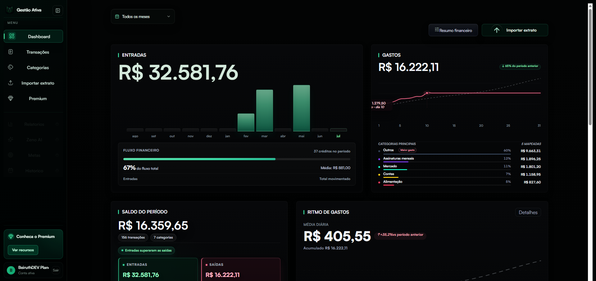
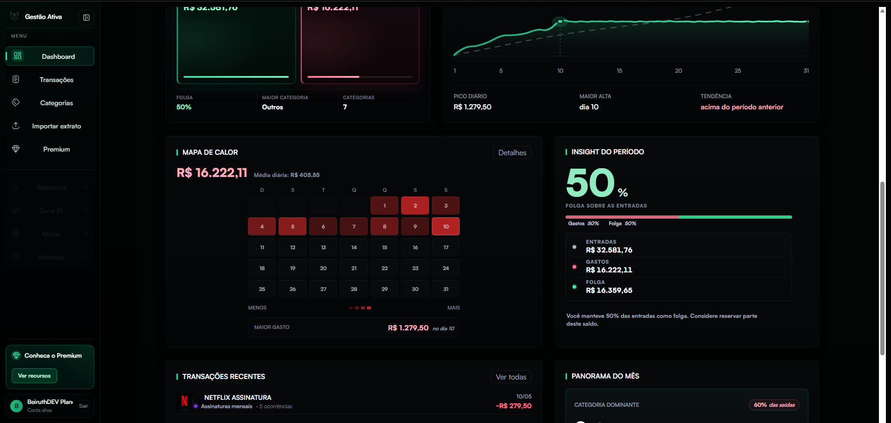
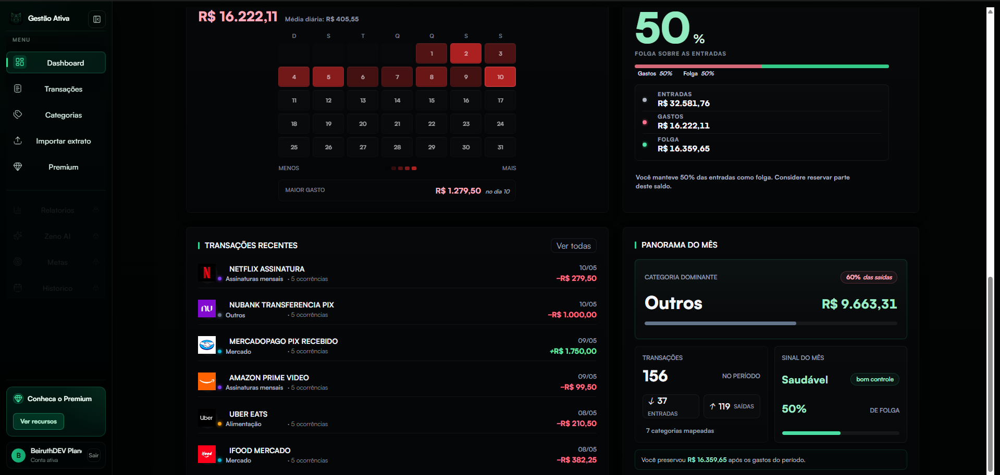
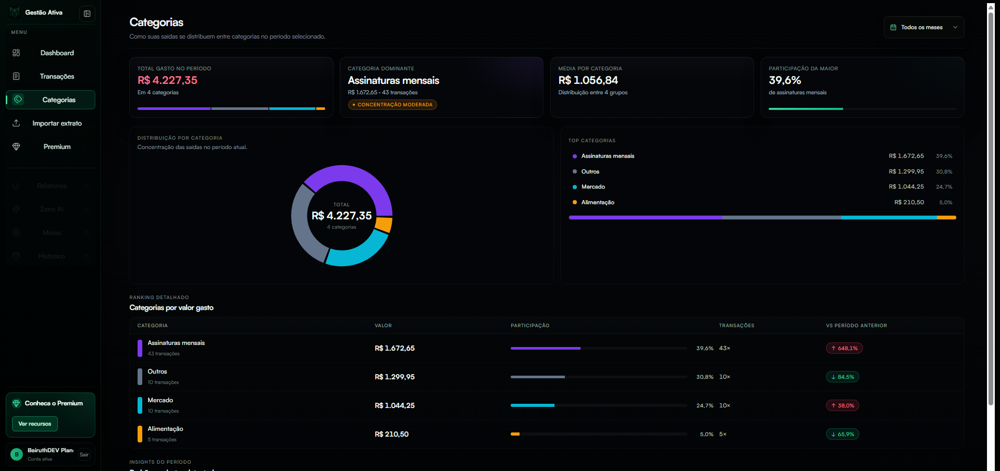
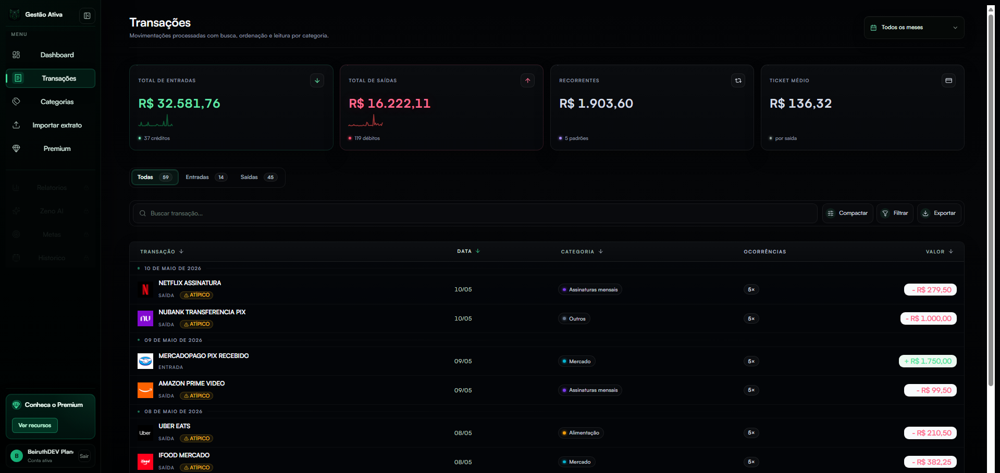

<div align="center">

# Gestão Ativa

**SaaS de gestão financeira pessoal que transforma extratos bancários em visão, rotina e planejamento.**

> Repositório público de demonstração visual e documentação do produto.  
> O código-fonte completo, autenticação, backend, regras de parsing, integrações, credenciais e lógica proprietária permanecem privados.


[Reportar problema](https://github.com/BeiruthDEV/gestao-ativa-demo/issues) ·
[Sugerir melhoria](https://github.com/BeiruthDEV/gestao-ativa-demo/issues)

</div>

---

## Sobre

O **Gestão Ativa** ajuda pessoas a entenderem a vida financeira sem depender de planilhas manuais ou conexão direta com conta bancária. O usuário importa um extrato exportado pelo banco e o sistema organiza transações, categorias, recorrências, indicadores, metas e compromissos financeiros em uma experiência visual clara.

A versão atual do produto evoluiu para dois níveis:

- **Free:** experiência essencial para importar extratos, visualizar dashboard, analisar categorias e consultar transações.
- **Premium:** workspace completo com Home Premium, visão geral avançada, planejamento mensal, transações editáveis, metas, hábitos, agenda financeira, relatórios, exportações e o **Zeno**, assistente financeiro do Gestão Ativa.

Este repositório existe para apresentar o produto publicamente com screenshots, documentação de stack e visão de arquitetura, sem expor nenhum código sensível.

---

## Demonstração Visual

> Os screenshots usam dados de demonstração. Nenhum print deve conter e-mails reais, extratos reais, tokens, contas bancárias, endpoints privados ou informações de produção.

### Home Premium


### Dashboard Free: entradas, gastos e saldo



### Dashboard Free: mapa de calor e insight do período



### Dashboard Free: transações recentes e panorama do mês



### Categorias Free



### Transações Free



---

## Identidade Visual

A experiência atual do Gestão Ativa segue uma estética premium, escura e de alto contraste:

- fundo preto profundo;
- superfícies em preto levemente esverdeado;
- verde como cor principal da marca;
- coral para gastos, alertas e saídas;
- ciano para contas, informações neutras e dados de apoio;
- dourado para metas, reservas e Premium;
- roxo para investimentos e hábitos específicos;
- bordas finas, glow controlado e hierarquia visual limpa;
- layouts densos o suficiente para trabalho real, sem perder leitura.

---

## Free vs Premium

| Recurso | Free | Premium |
|---|---:|---:|
| Cadastro e login | Sim | Sim |
| Importação de extratos | Sim, com limite mensal | Ilimitada conforme plano |
| Formatos de extrato | PDF, CSV, OFX, QBO e OFC | PDF, CSV, OFX, QBO e OFC |
| Dashboard financeiro | Básico | Avançado |
| Categorização automática | Sim | Sim |
| Detecção de recorrências | Sim | Sim |
| Lista de transações | Sim | Sim, com filtros e edição |
| Exportação | Simples | Avançada |
| Home Premium | Não | Sim |
| Visão Geral avançada | Não | Sim |
| Planejamento mensal | Não | Sim |
| Metas | Não | Sim |
| Hábitos financeiros | Não | Sim |
| Agenda financeira | Não | Sim |
| Zeno | Não | Sim |
| Relatórios avançados | Não | Sim |
| Histórico de uploads | Limitado | Completo |

---

## Módulos do Produto

### Home Premium

Central inicial do workspace Premium. Reúne boas-vindas, acesso rápido às áreas principais, resumo do plano e destaque para o Zeno.

### Visão Geral

Dashboard avançado com saldo, entradas, gastos, economia, investimentos, evolução temporal, categorias, próximos vencimentos e insights do Zeno.

### Planejamento

Área de organização mensal para comparar previsto vs realizado, acompanhar entradas, gastos, contas fixas, reservas, investimentos e saldo final do mês.

### Transações

Tabela de movimentações com busca, filtros por tipo, origem e categoria, leitura visual por cores, edição e acompanhamento de lançamentos importados, manuais ou criados pelo Zeno.

### Metas

Controle de metas financeiras ou pessoais com progresso, prazo, valor-alvo, status e recomendações.

### Hábitos

Rotina de hábitos financeiros com check diário, grade de constância e cores individuais para cada hábito.

### Agenda Financeira

Calendário de vencimentos, contas, compromissos financeiros, filtros por tipo e marcação de eventos concluídos.

### Zeno

Assistente financeiro do Gestão Ativa. Na versão atual, o Zeno interpreta mensagens em linguagem natural, registra lançamentos e entrega orientações contextuais dentro do workspace Premium.

### Relatórios e Exportação

Exportação por período e geração de relatórios para análise, compartilhamento ou arquivamento.

### Importação de Extratos

Fluxo de upload de arquivos exportados pelo banco. O produto não exige senha bancária para a experiência baseada em arquivo.

---

## Stack Atual do Produto Real

### Frontend

| Tecnologia | Uso |
|---|---|
| Next.js 16 | Aplicação web com App Router |
| React 19 | Interface e composição de telas |
| TypeScript 5 | Tipagem do frontend |
| Recharts | Gráficos financeiros |
| Framer Motion | Animações e transições |
| Lucide React | Ícones |
| React Dropzone | Upload de arquivos |
| PostHog | Analytics de produto |
| Vercel Analytics | Métricas de frontend |

### Backend

| Tecnologia | Uso |
|---|---|
| Python 3.11/3.12 | Backend e processamento |
| FastAPI | API REST |
| Uvicorn | Servidor ASGI |
| SQLite | Persistência atual de usuários, sessões, uploads, transações e assinaturas |
| pdfplumber | Leitura de PDFs com texto selecionável |
| pandas | Normalização e apoio no processamento de extratos |
| thefuzz | Correspondência aproximada de categorias |
| slowapi | Rate limiting |
| Stripe SDK | Checkout, assinatura e webhooks |

### Deploy

| Camada | Plataforma |
|---|---|
| Frontend | Vercel |
| Backend | Render |
| Billing | Stripe |

---

## Arquitetura em Alto Nível

```text
Usuário
  |
  v
Next.js App Router
  |
  |-- Landing, login, cadastro e páginas públicas
  |-- /app: workspace Free autenticado
  |-- /premium: workspace Premium autenticado
  |-- /api/*: proxy seguro para o backend
  |
  v
FastAPI Backend
  |
  |-- autenticação e sessões
  |-- upload e validação de extratos
  |-- processamento e normalização de transações
  |-- limites de uso por plano
  |-- billing e webhooks Stripe
  |
  v
SQLite / armazenamento operacional
```

### Estrutura do Projeto Real

```text
gestao-ativa/
├── src/
│   ├── app/                  # Rotas Next.js
│   │   ├── app/              # Workspace Free
│   │   ├── premium/          # Workspace Premium
│   │   ├── api/              # Proxies e rotas Next.js
│   │   ├── login/
│   │   ├── cadastro/
│   │   ├── ajuda/
│   │   ├── termos/
│   │   └── privacidade/
│   ├── components/           # Componentes reutilizáveis
│   ├── features/             # Domínios do produto
│   └── lib/                  # Serviços, stores, auth e utilitários
├── backend/                  # API FastAPI privada
├── public/                   # Assets públicos do app
└── docs/                     # Documentação técnica privada
```

> Esta estrutura descreve o produto real. Este repositório público de demonstração não contém esses diretórios de código.

---

## Variáveis de Ambiente

Este repositório público **não precisa de variáveis de ambiente**, porque não executa o app real.

No produto privado, as variáveis são separadas por ambiente e incluem, de forma sanitizada:

| Variável | Finalidade |
|---|---|
| `BACKEND_URL` | URL interna/pública do backend |
| `NEXT_PUBLIC_API_URL` | URL pública alternativa da API |
| `UPLOAD_PROXY_SECRET` | Segredo compartilhado entre frontend e backend |
| `ALLOWED_ORIGINS` | Origens permitidas no CORS |
| `MAX_UPLOAD_BYTES` | Tamanho máximo de upload |
| `PARSE_TIMEOUT_SECONDS` | Tempo máximo de processamento |
| `AUTH_DB_PATH` | Caminho do banco operacional |
| `STRIPE_SECRET_KEY` | Chave privada Stripe |
| `STRIPE_WEBHOOK_SECRET` | Assinatura de webhooks |
| `STRIPE_PRICE_PREMIUM_MONTHLY` | Price ID do plano Premium mensal |
| `STRIPE_SUCCESS_URL` | URL pós-checkout concluído |
| `STRIPE_CANCEL_URL` | URL pós-checkout cancelado |

Nenhum valor real deve ser publicado neste repositório.

---

## Instalação

Este repositório não é uma aplicação executável. Ele contém apenas documentação pública e assets visuais.

```bash
git clone https://github.com/BeiruthDEV/gestao-ativa-demo.git
cd gestao-ativa-demo
```

Depois, abra o `README.md` no GitHub ou em um editor Markdown.

Não há `npm install`, backend local, banco de dados, autenticação, Stripe, parsing ou integração bancária neste repositório.

---

## Organização dos Screenshots

Estrutura atual dos assets públicos deste repositório:

```text
assets/
├── home-premium.png
├── dash_free_1.png
├── dash_free_2.png
├── dash_free_3.png
├── categorias_free.png
└── transacoes_free.png
```

Recomendações para os prints:

- usar resolução alta, preferencialmente desktop;
- evitar zoom excessivo ou cortes que escondam o layout;
- usar dados fictícios e nomes genéricos;
- manter a identidade visual atual do produto;
- capturar telas com boa densidade em 1366x768, 1440x900 e 1920x1080 quando possível;
- adicionar novos screenshots à pasta `assets/` e referenciá-los diretamente na galeria acima.

---

## Segurança e Escopo Público

Este repositório não deve conter:

- código-fonte do app real;
- arquivos `.env`;
- chaves, tokens ou secrets;
- banco de dados;
- dumps de produção;
- endpoints privados;
- regras proprietárias de parsing;
- webhooks reais;
- credenciais Stripe, Vercel, Render ou analytics;
- extratos ou dados financeiros reais;
- autenticação real;
- lógica de billing;
- lógica sensível de categorização ou conciliação.

Todo conteúdo visual deve usar dados mockados.

---

## Roadmap Público

- Atualizar screenshots com a experiência Premium atual.
- Mostrar o fluxo completo de visão geral, planejamento, transações, hábitos, metas, agenda e Zeno.
- Evoluir a documentação visual conforme o produto real amadurecer.
- Adicionar demonstrações da exportação e relatórios quando os prints estiverem prontos.
- Documentar a evolução do app mobile em desenvolvimento com **React Native e Expo**.
- Consolidar a experiência Premium mensal no estilo controle financeiro guiado.
- Expandir a cobertura de importação e revisão de extratos no produto privado.

---

## Mobile

O app mobile do Gestão Ativa está em desenvolvimento com **React Native** e **Expo**. A proposta é levar a experiência principal de acompanhamento financeiro, Zeno, metas, hábitos e agenda para uma interface mobile nativa, mantendo o backend e a identidade do produto.

---

## Licença

Este repositório é uma demonstração pública do produto Gestão Ativa. O uso dos textos e imagens é permitido apenas para apresentação, portfólio e referência do projeto.

O código-fonte completo do produto real é privado.

---

<div align="center">

**Gestão Ativa** · Finanças pessoais com clareza, rotina e ação.

[BeiruthDEV](https://github.com/BeiruthDEV)

</div>
